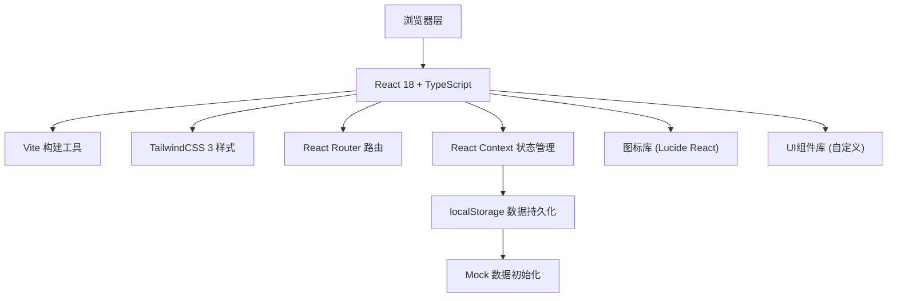
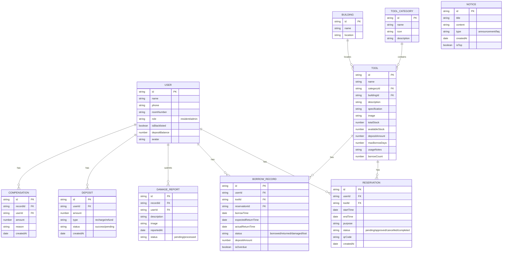

## 1. 架构设计

本项目为纯前端单页应用，所有数据使用localStorage持久化和Mock数据模拟，无需后端服务。



## 2. 技术描述

- **前端框架**：React 18 + TypeScript
- **构建工具**：Vite 5
- **样式方案**：TailwindCSS 3 + CSS Variables
- **路由管理**：React Router v6
- **状态管理**：React Context + useReducer
- **数据持久化**：localStorage
- **图标库**：Lucide React
- **二维码生成**：qrcode.react
- **日期处理**：date-fns

## 3. 路由定义

| Route | 页面名称 | 访问权限 |
|-------|---------|----------|
| `/` | 首页 | 所有用户 |
| `/tools` | 工具目录 | 所有用户 |
| `/reserve/:toolId` | 预约页 | 已登录用户 |
| `/records` | 借还记录页 | 已登录用户 |
| `/profile` | 个人中心 | 已登录用户 |

## 4. 数据模型

### 4.1 实体关系图



### 4.2 Mock数据定义

```typescript
// 工具分类
const categories = [
  { id: '1', name: '电动工具', icon: 'drill', description: '电钻、电锯、砂光机等' },
  { id: '2', name: '登高设备', icon: 'ladder', description: '梯子、脚手架等' },
  { id: '3', name: '搬运工具', icon: 'truck', description: '手推车、平板车等' },
  { id: '4', name: '测量工具', icon: 'ruler', description: '卷尺、水平仪等' },
  { id: '5', name: '清洁工具', icon: 'spray-can', description: '高压水枪、吸尘器等' },
  { id: '6', name: '园艺工具', icon: 'flower', description: '剪刀、铲子、浇水壶等' }
];

// 楼栋
const buildings = [
  { id: '1', name: '1号楼', location: 'A区' },
  { id: '2', name: '2号楼', location: 'A区' },
  { id: '3', name: '3号楼', location: 'B区' },
  { id: '4', name: '5号楼', location: 'B区' },
  { id: '5', name: '6号楼', location: 'C区' }
];

// 工具示例
const tools = [
  {
    id: '1',
    name: '冲击电钻',
    categoryId: '1',
    buildingId: '1',
    description: '博世冲击电钻，适用于墙面打孔、家具安装',
    specification: '功率: 800W, 最大钻孔直径: 13mm',
    image: '...',
    totalStock: 3,
    availableStock: 2,
    depositAmount: 200,
    maxBorrowDays: 3,
    usageNotes: '使用时请佩戴护目镜，禁止在潮湿环境使用',
    borrowCount: 156
  }
];

// 公告
const notices = [
  { id: '1', title: '工具借用须知', content: '请在预约后24小时内取件...', type: 'announcement', createdAt: '2026-06-01', isTop: true },
  { id: '2', title: 'FAQ: 押金如何退还?', content: '归还工具经检查无损后...', type: 'faq', createdAt: '2026-06-05', isTop: false }
];
```

## 5. 项目目录结构

```
src/
├── assets/             # 静态资源
│   └── images/         # 工具图片、图标
├── components/         # 公共组件
│   ├── Layout/         # 布局组件
│   ├── ToolCard/       # 工具卡片
│   ├── StatusBadge/    # 状态标签
│   ├── Modal/          # 弹窗组件
│   ├── QRCode/         # 二维码组件
│   └── Loading/        # 加载组件
├── context/            # 状态管理
│   ├── AuthContext/    # 用户认证
│   ├── ToolContext/    # 工具数据
│   └── RecordContext/  # 借还记录
├── data/               # Mock数据
│   ├── mockTools.ts
│   ├── mockUsers.ts
│   └── mockRecords.ts
├── hooks/              # 自定义Hooks
│   ├── useAuth.ts
│   ├── useTools.ts
│   └── useLocalStorage.ts
├── pages/              # 页面组件
│   ├── Home/           # 首页
│   ├── Tools/          # 工具目录
│   ├── Reserve/        # 预约页
│   ├── Records/        # 借还记录
│   └── Profile/        # 个人中心
├── types/              # TypeScript类型定义
│   └── index.ts
├── utils/              # 工具函数
│   ├── date.ts
│   ├── storage.ts
│   └── qrcode.ts
├── App.tsx
├── main.tsx
└── index.css
```

## 6. 核心功能实现要点

### 6.1 扫码功能
- 前端模拟扫码：通过输入框输入工具编号或点击"模拟扫码"按钮
- 二维码生成：使用qrcode.react库生成预约二维码
- 二维码包含：预约ID、用户ID、工具ID、时间戳

### 6.2 到期提醒
- 页面加载时检查当前用户借用记录
- 距离到期时间小于24小时显示橙色提醒
- 已逾期显示红色警告并置顶

### 6.3 管理员统计
- 使用简单的数组统计工具借用排行
- 按分类统计借用频次
- 展示逾期率、损坏率等关键指标

### 6.4 黑名单机制
- 用户损坏工具超过3次或逾期超过5次自动标记
- 黑名单用户无法提交新预约
- 管理员可手动解除黑名单

### 6.5 押金管理
- 预约时自动从账户余额扣除押金
- 归还无损后自动退还
- 损坏时根据损失金额扣除相应部分
