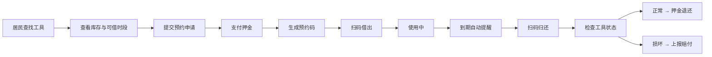

## 1. 产品概述

社区工具借用平台，面向社区居民和物业前台，解决电钻、梯子、手推车等共享工具登记混乱的问题。居民可快速查找工具、查看规则、在线预约；物业可高效管理借还、追踪记录、分析使用数据。

## 2. 核心功能

### 2.1 用户角色

| 角色 | 登录方式 | 核心权限 |
|------|----------|----------|
| 社区居民 | 房号+手机号验证 | 浏览工具、提交预约、扫码借还、查看记录、损坏上报 |
| 物业管理员 | 账号密码登录 | 全量功能+工具调配、黑名单管理、数据统计、押金管理、公告发布 |

### 2.2 功能模块

1. **首页**：工具分类快捷入口、热门工具推荐、公告通知、快速搜索、借用指南
2. **工具目录**：分类/楼栋筛选、工具详情、库存查看、可借时段查询、扫码入口
3. **预约页**：预约表单、时段选择、押金说明、预约确认
4. **借还记录页**：借用记录列表、状态筛选、扫码借出/归还、损坏上报、赔付记录
5. **个人中心**：个人信息、历史借还、押金余额、黑名单状态、常见问题

### 2.3 页面详情

| 页面名称 | 模块名称 | 功能描述 |
|-----------|-------------|---------------------|
| 首页 | 顶部导航 | 角色切换、用户信息、快捷入口 |
| 首页 | 搜索区域 | 关键词搜索工具、分类快捷按钮 |
| 首页 | 热门工具 | 展示借用频次最高的Top6工具 |
| 首页 | 公告栏 | 滚动展示常见问题和平台公告 |
| 首页 | 快捷操作 | 一键预约、扫码借还入口 |
| 工具目录 | 筛选区域 | 按分类（电钻/梯子/手推车等）、按楼栋筛选 |
| 工具目录 | 工具列表 | 卡片展示工具名称、库存、状态、图片 |
| 工具目录 | 工具详情 | 规格说明、使用须知、可借时段、押金金额 |
| 预约页 | 预约表单 | 选择工具、借用时段、借用事由 |
| 预约页 | 押金确认 | 显示押金金额、支付方式说明 |
| 预约页 | 预约确认 | 生成预约码、显示取件地点 |
| 借还记录页 | 记录列表 | 按时间/状态筛选借用记录 |
| 借还记录页 | 扫码操作 | 扫码借出、扫码归还功能 |
| 借还记录页 | 损坏上报 | 上传图片、描述损坏情况 |
| 借还记录页 | 管理员面板 | 手动调配、黑名单管理、赔付处理 |
| 个人中心 | 个人信息 | 房号、联系方式、修改密码 |
| 个人中心 | 我的记录 | 个人历史借用记录查询 |
| 个人中心 | 押金管理 | 押金余额、充值、退还记录 |
| 个人中心 | 常见问题 | FAQ列表、使用规则说明 |

## 3. 核心流程

### 3.1 居民借用流程
居民打开首页 → 搜索或分类查找工具 → 查看工具详情和可借时段 → 提交预约申请 → 支付押金 → 生成预约码 → 到物业扫码借出 → 使用 → 到期自动提醒 → 扫码归还 → 确认无损 → 押金退还

### 3.2 物业操作流程
管理员登录 → 查看预约申请 → 扫码借出工具 → 监控到期提醒 → 接收归还扫码 → 检查工具状态 → 处理损坏上报 → 记录赔付 → 查看使用统计 → 发布公告

### 3.3 异常处理流程
工具损坏 → 居民上报 → 物业审核 → 评估损失 → 扣除押金 → 记录赔付 → 黑名单标记（严重情况）

## 4. 用户界面设计

### 4.1 设计风格
- **主色调**：深蓝色(#165DFF)，代表专业、可靠、稳重
- **辅助色**：绿色(#00B42A)表示可借/正常，橙色(#FF7D00)表示提醒/预约中，红色(#F53F3F)表示不可借/损坏
- **按钮风格**：圆角8px，扁平化设计，hover有轻微上浮效果
- **字体**：思源黑体，清晰易读，标题16-20px，正文14px
- **布局风格**：卡片式布局，清晰分区，操作按钮大而明显
- **图标风格**：线性图标，简洁明了，避免花哨

### 4.2 页面设计概述

| 页面名称 | 模块名称 | UI元素 |
|-----------|-------------|-------------|
| 首页 | 搜索区域 | 大搜索框、分类图标按钮、渐变色背景 |
| 首页 | 热门工具 | 横向滚动卡片、借用次数徽章、渐变边框 |
| 首页 | 公告栏 | 滚动文字条、浅灰背景、信息图标 |
| 工具目录 | 筛选区域 | Tab切换分类、楼栋下拉选择、搜索框 |
| 工具目录 | 工具卡片 | 工具图片、名称、库存标签、状态色标、预约按钮 |
| 工具目录 | 详情弹窗 | 大图展示、规格参数表、时段选择器、须知说明 |
| 预约页 | 表单区域 | 步骤指示器、日期时间选择器、下拉选择 |
| 预约页 | 押金区域 | 金额高亮显示、押金规则说明、勾选确认 |
| 预约页 | 确认区域 | 预约二维码、取件信息卡、操作按钮组 |
| 借还记录页 | 列表区域 | 时间线布局、状态标签、扫码按钮 |
| 借还记录页 | 管理员统计 | 数据卡片、柱状图、Top排行 |
| 个人中心 | 信息区域 | 头像、房号、身份标签、菜单列表 |
| 个人中心 | 记录列表 | 可折叠卡片、详情展开、状态色标 |

### 4.3 响应式
- 桌面端优先设计，1200px最佳浏览宽度
- 平板端自适应，卡片换行展示
- 移动端单列布局，底部导航栏，触摸优化（按钮最小44x44px）

### 4.4 交互动效
- 页面切换：淡入淡出，300ms过渡
- 按钮点击：缩放0.95，100ms反馈
- 列表加载：骨架屏占位，渐入显示
- 状态变化：颜色过渡，轻微弹跳提示
- 弹窗出现：从底部滑入，背景模糊
